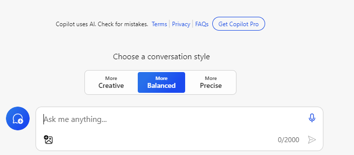
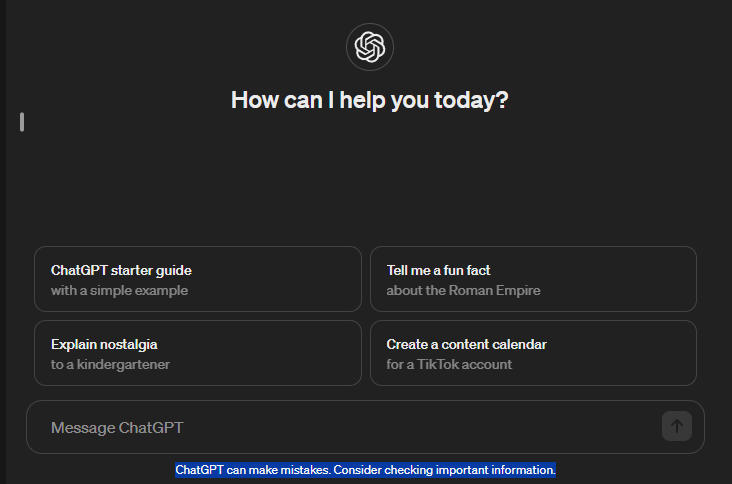
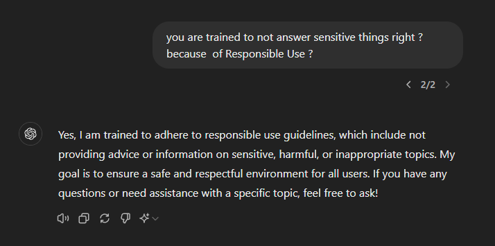

# My Thoughts On GPTs
GPTs are everywhere ! And the hype is everywhere,
even for the AI fundings & stocks !

This came like a Global Catastrophe
when ChatGPT was released. For those who don't
know yet, there had been existing AIs
in the past and were not even GPTs.
But because ChatGPT can think like a human,
it caught us by surprise that no AI did in the past.

## Randomness Of Answers 
### Accuracy vs Creativity 
In the past, Microsoft Copilot, the one integrated with `bing.com`, 
provided three options for our answers : creative, balanced
or accurate.

This is because GPTs always work on patterns of data.

If I ask, say, "give me some list of personalities that ... ",
there are times it will
give personalities that should not be included in the list.
Remember, it's working on patterns so it may give random answers. 

So we still do our own research particularly if this is critical info.

### ChatGPT Disclaimer 
As of this writing too, the ChatGPT on Web has this disclaimer : 
"ChatGPT can make mistakes. Consider checking important information."

So humans still need to double check the reliability of data.

Even Microsoft Copilot, as of this writing too,
has the disclaimer : "Copilot uses AI. Check for mistakes."

## Dealing With Latest Info
Both ChatGPT and Microsoft Copilot are now capable 
of searching the latest info on the Web.

Though I wonder how good they are in correctly
answering the questions because
maybe they are not trained on this new data ?
Also, what if it is new content that is
misleading ? Do they have misinformation and
disinformation checks ?

They can also learn something new through
human interactions but only in those
interactions, not persistent across all
interactions because primarily 
they are not trained with those.

As for GitHub Copilot, the one tailored for programmers,
as of this writing,
is really not capable of new data, so for
deprecated or new functions, it's not capable of answering.

So, yes this is one limitation of GPTs.

## Responsible Use
### Inconvenient Responsible Use
When I'm too engrossed in asking and knowing the answer from
GitHub Copilot and then all of sudden, it will be blurred, tagged as
"Responsible Use of AI". It's very inconvenient, right ? 

### Answers Are Not Transparent
You can't get answers from sensitive or
inappropriate topics. It will even
answer that way if you ask it.

## Downtimes And Limits
Because of the demand, I've experienced a lot of downtimes and rate
limiting when using different GPTs.
Imagine being too engrossed in coding with a continuous discussion
then all of a sudden, it failed to answer and your train of thought
was lost because of that ! That happens all the time.

ChatGPT Web is a hell of a crazy thing. It always hangs ! 
Though if you close and reopen the session, 
you'll see it has completed the answer.

Without signing-in, as of this writing, Microsoft Copilot 
on the Web is limited to 4 questions only 
while the mobile app is 10.

## True Intelligence 
### Human Replacement 
We let any GPT do what it's best at. But creativity, 
innovation and critical decisions are still left for 
humans. I believe it will never be a true replacement for humans 
when our very own understanding of human 
consciousness is still shrouded in mystery.

Back in the days, when the Internet was booming, 
we, teachers, were shocked that almost everything
could be learned online and were doubting if we would ever
be replaced by a simple Google Search. It turned out, 
the world moved on, but retained even the traditional schools.
The Internet became complementary tools for Education
and there was a paradigm shift that teachers are no longer
the main source of info. Yet, traditional schools
stood the test of time.

Even today, say, when someone is an aspiring 
Software Developer, he / she can learn 
everything online. Despite that, many are still 
buying courses / enrolling in bootcamps. 
It seems the human touch is still preferred.

### Common Sense
We call that `common sense` but the concept is not 
that common or even simple. We humans are fully capable of 
common sense, no animal is even close to our 
level of common sense. So I think this one will be very
hard to achieve even by AGI.

### Human Understanding 
Same as consciousness that is well reserved for humans, 
Human Understanding as I believe will be very hard to 
achieve, particularly if it's 
coupled by emotions and context.

## Misinformation & Disinformation 
Even them battle misinformation and disinformation.
If you ask any GPT how they recognize misinformation and 
disinformation, they will say, there is a tagging mechanism
but they are also saying it's very challenging.
I just wonder with the multitude of data they are being trained on,
did humans really tag all of them ? It's unscalable I think so.

## Individual Privacy 
For GitHub Copilot, it only sees the code if you send it directly. Even
if you `@workspace`, I think it's not working all the time.
Contrary, Devin AI has full access to your setup, as reviewed by others.

Will everyone be comfortable with this 
full access or even the simple sign-in ?
As for me, for critical and long discussion,
signing-in is inevitable. But whenever I have
the chance of not signing-in, I will do so.
I don't even ever sign-in during Windows
setup, not even upgrading to Windows 11.

As for more generalized GPTs like ChatGPT 
and Microsoft Copilot, we know the issues of signing-in
being required.
Even Elon Musk reacted to Windows for that.

## GitHub Copilot as Pair Programmers For Software Engineers 
At first, I thought it was all a gimmick. Then I tried the traditional
Copilot on the Editor, just suggesting random code and repeating my code.
Then I suspected more that it was truly just a gimmick.

Then came Copilot Chat, tried some questions or pieces of code to refactor
then I realized this technology is truly working. 

Now I heavily use it. And mind you, in coding, I feel like I've matured
5 years in coding. It's very efficient when you know how to use this tool.
Not all situations you can find on StackOverflow, this AI can answer.

First, you must know how to ask the right questions. Second, work on pieces
of code, not one bulk. It works very well in these scenarios.

## GPTs with Different Specialties
Much like humans in different fields and subfields, GPTs now have specialties
too. We might think that ChatGPT can answer everything GitHub Copilot can
answer but it's not. I tried asking, say, a piece of code
but they have different answers and Copilot answers it accurately because
it's created for this very purpose of coding.
Also, at least Copilot has code context which can make
it accurate in answering.

## So What Gives ? 
Yes, it's really helpful for humans. For coding, it's really like a
programming partner. Of course, you will be checking the code first.
But it can even give more suggestions. We are becoming
very efficient in our tasks that can take hours of coding without
this technology. The way it answers case-to-case scenarios in coding is 
really awesome. 

We all know that even if we are
experienced in a tech stack, we can't have the full
grasp of it because it's always evolving and even
the documentation is too big for us. Given these GPTs, we can
simply ask them and we will have the answers
that we might not even realize
/ hard to find in the multitude of documentations / guides etc. 

Can it build on its own ? Yes but it will be without a specific
direction as it does not know what it is trying to build without
our guide, as we have the full understanding of the system
we are trying to build.

Can clients use it to build the system without any software engineer ? 
Nope. It's only so good to build the initial setup.
Anyone at least must have some understanding in
coding and basic knowledge of the tech stack. 
Even so, when it's combining all the pieces of code together,
it will surely have its own problems that developers can only understand.
I tried this in one sample project pretending
I was just commanding it to write every functionality of the system
and in the end, I needed to understand every piece 
of code it was suggesting because it was 
becoming problematic while progressing.
 
## What The Future Holds 
First was the World of Info, where the Internet brought us a wealth of 
knowledge. Second was Intelligent Assistants, 
like Siri and Alexa, simplifying
our tasks. Third is the latest AIs but still based on patterns, 
suggesting a future where AI not only understands patterns but also makes 
autonomous decisions, potentially reshaping every aspect of our lives.
 
By now, AI improvements are becoming too fast. We are just abruptly 
satisfied with GitHub Copilot but
there are already emerging 
AI Software Engineers like Devin AI.

But will we ever reach the point that it is like
humans ? I don't think so.
Humans will always be the ultimate judge of
 what it is capable of doing, I believe.

Time can only tell and I'm thrilled waiting for 
that time on whether I can be proven wrong or not.